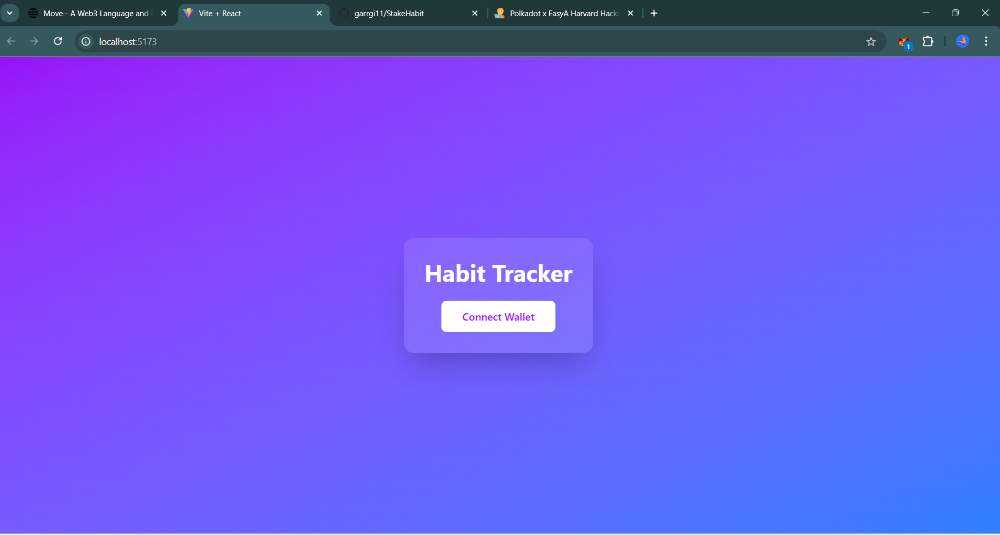

# 🧠 OnChain Habit Tracker

**A fully on-chain gamified habit tracker where users stake tokens on personal growth—or lose them if they break the streak.**

---

## 📜 Full Description

**Problem:**  
Building consistent habits is hard. Motivation fades, life gets busy, and without accountability, goals are abandoned. There’s no real consequence for breaking a streak—or reward for sticking to one.

**Solution:**  
OnChain Habit Tracker transforms personal growth into a high-stakes game. Users commit to habits by staking tokens. If they complete the habit within the set timeline, they get their tokens back (plus rewards). If not, the tokens are burned—providing a powerful incentive to follow through.

**Why Polkadot:**  
We chose Polkadot Asset Hub for its secure and cost-effective environment for deploying smart contracts. Its parachain architecture allows for scalable dApps with strong interoperability, while Substrate-based tooling enabled rapid deployment. The trustless nature of Polkadot ensures every action—stake, verify, burn—is permanently recorded and verifiable on-chain.

---

## ⚙️ Technical Description

- **Smart Contracts:** Written in Solidity and compiled/deployed via Polkadot's EVM-compatible **Asset Hub**.
- **Deployment:** Custom smart contract deployed and tested on **Asset Hub**, not a boilerplate or template.
- **Storage:** Habit actions (stake, complete, fail) are recorded immutably on-chain. Metadata optionally stored on IPFS.
- **SDKs & Tools Used:**
  - Solidity
  - Hardhat (compilation, deployment, local dev)
  - Ethers.js (frontend–contract interaction)
  - React + Tailwind CSS (UI/UX)
  - Polkadot.js API (for verification/explorer integrations)

**Unique Polkadot Features Used:**
- Asset Hub for secure token handling
- On-chain transparency via Substrate-backed block explorer
- Lightweight gas fees for frequent habit-check calls
- Full decentralization without external servers

---

## 🚀 Features

- **Staking Mechanism**  
  Users commit tokens on new habits to create real accountability.

- **Rewards + Penalties**  
  - ✅ Success = full stake returned + potential rewards  
  - ❌ Failure = tokens are **burned** on-chain

- **Gamified UX**  
  Earn streak badges, climb leaderboards, and stay motivated through visible progress.

- **Immutable Ledger**  
  Every user action is permanently recorded on the blockchain.

- **Wallet-Connected Frontend**  
  Interact with smart contracts using MetaMask, WalletConnect, or other Polkadot-compatible wallets.

---

## 💻 Demo Video

🎥 Watch the full demo here:  
📎 [Demo Video Link][Click here to watch the video](images/Video.zip)

---

## 📸 UI Screenshots

| Habit Dashboard |
|-----------------|
|  |

---

## 🔍 Smart Contract Overview

The smart contract handles:
- **Token staking** for each habit
- **Deadline tracking** and verification of completion
- **Automated burning** of failed stake tokens
- **Events** for frontend tracking (HabitCreated, HabitCompleted, StakeBurned)

> 🔧 [View smart contract source code](https://github.com/garrgi11/StakeHabit/blob/main/asset-hub-project/contracts/habittracker.sol)

---

## 📂 GitHub Structure + Loom Walkthrough

🎙️ Watch the full repo walkthrough (with audio):  
📎 [Click here to watch the video](images/Video.zip)

---

## 🔗 Deployed Contract Info

- ✅ **Contract Address:** `0x7CebE2AB3010CC125cf46073378451607dfebCBf`
- 🔎 **Block Explorer Link (Asset Hub):**  
  [View on Polkadot Asset Hub Explorer](https://assethub-westend.subscan.io/account/0x7CebE2AB3010CC125cf46073378451607dfebCBf)

---

## 🖼️ Canva Slides

📊 [Click to View Presentation Deck (Team, Problem, Solution, etc.)](https://www.canva.com/design/DAGlzLfvyM0/d7JkPWTxGhEewayuA90pHQ/edit?utm_content=DAGlzLfvyM0&utm_campaign=designshare&utm_medium=link2&utm_source=sharebutton)

---

## 🧠 Team

Built by passionate builders at the EasyA x Polkadot Hackathon @ Harvard  
- Gargi Pathak (Solidity & Frontend Dev)  

---

## 💡 Summary (for submission)

**Builds an on-chain habit-tracking dApp to help users commit to goals and stay accountable using a tokenized reward/burn system on Polkadot Asset Hub.**

---

## 📘 License

MIT License — open-source forever 🫶

